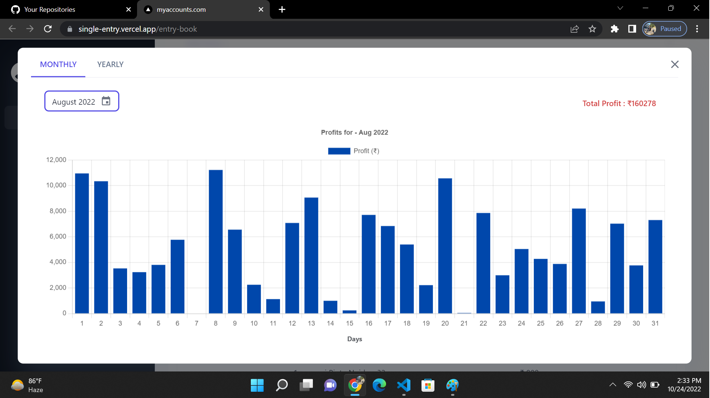
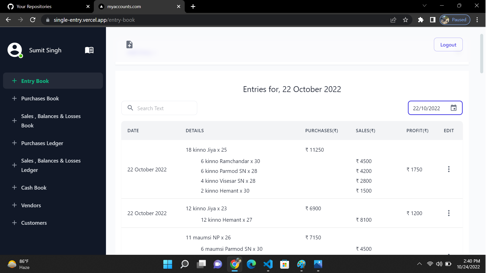
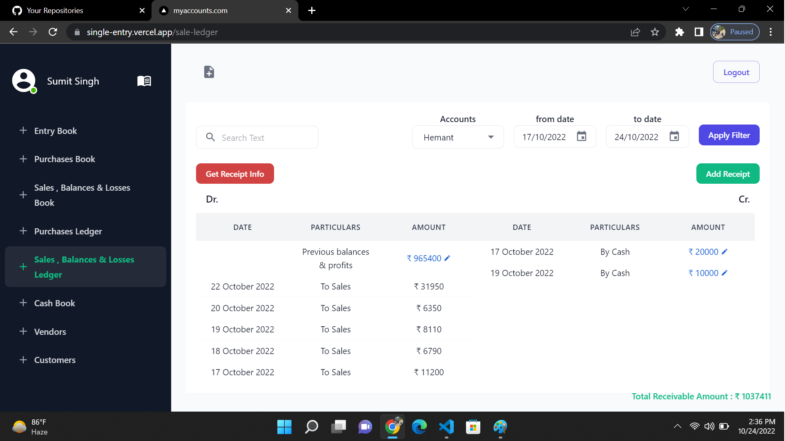
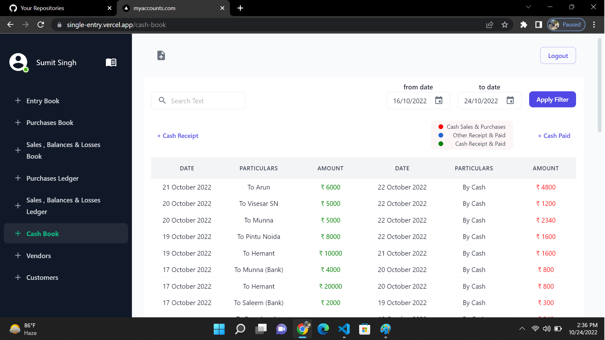
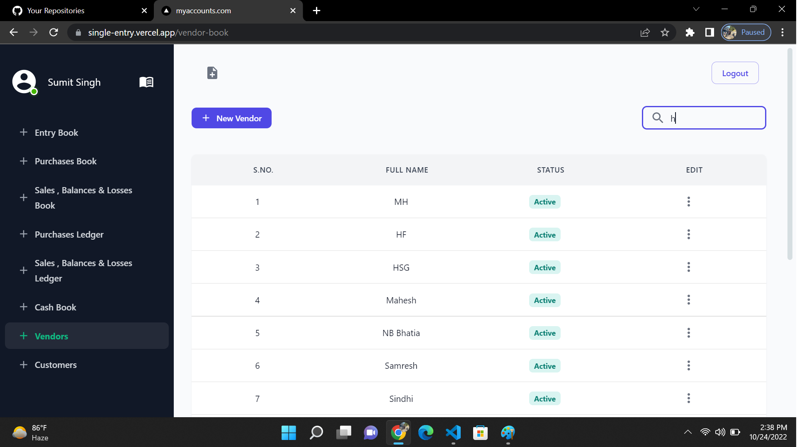
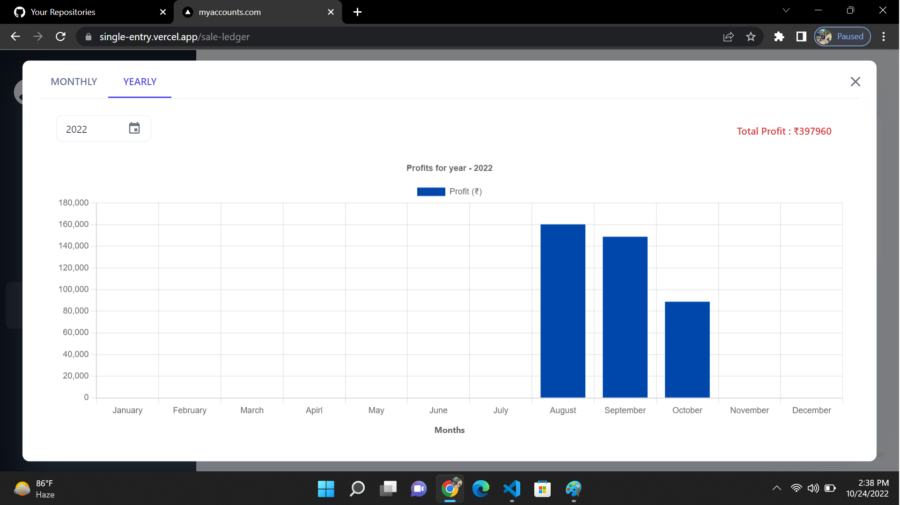
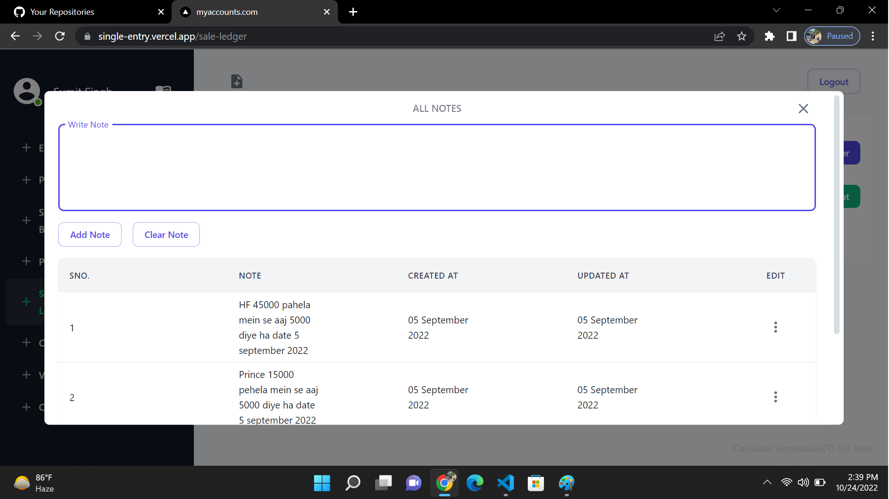

# Accounting-Website - https://single-entry.vercel.app

Welcome to the Accounting Website repository! This website provides a comprehensive accounting solution, including entry-book, purchase book, sales book, purchase and sales ledger, cashbook, and interactive vendor and customer management. By simply passing an entry in the entry-book, all the necessary books and ledgers are automatically prepared. It also provides insights into monthly, daily, and yearly profits.

## Table of Contents

- [Features](#features)
- [Technologies Used](#technologies-used)
- [Setup](#setup)
- [Usage](#usage)
- [Contributing](#contributing)
- [License](#license)

## Features

- Entry-book: Allows users to pass accounting entries for efficient record-keeping.
- Purchase Book: Automatically generates a book for tracking purchase transactions.
- Sales Book: Automatically generates a book for tracking sales transactions.
- Purchase and Sales Ledger: Maintains ledger accounts for vendors and customers.
- Cashbook: Provides a record of cash inflows and outflows.
- Interactive Vendor and Customer Management: Allows users to register and manage vendors and customers.
- Automatic Preparation of Books: All books and ledgers are prepared automatically based on the entry-book entries.
- Profit Analysis: Provides insights into monthly, daily, and yearly profits.

## Technologies Used

- Frontend: Next/ReactJS, Html, Css.
- Backend: NodeJS.
- Database: MongoDB.
- Other Libraries/Frameworks: Materail UI, Tailwind CSS

## Setup

1. Clone the repository:
```bash
git clone https://github.com/sumit-singh1196/Accounting-Website.git

2.Change to the project directory:
```bash
cd accounting-website

3.Install the dependencies:
```bash
npm install

4.Start local server:
```bash
npm run dev

## Usage
1. Register vendors and customers in the interactive management section.
2. Pass accounting entries in the entry-book.
3. View the automatically generated books, ledgers, and cashbook.
4. Analyze profits on a monthly, daily, or yearly basis.

















